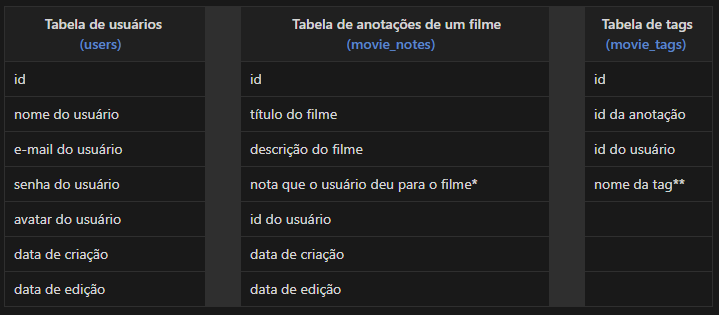

<h1 align="center"> Stage 08 - Desenvolvimento Back-End Aplicação Lista de Filmes</h1>

Você pode acessar o projeto Front-End através do link: 
  <a href= "https://github.com/A1exLima/rocketseat-stage9-frontEnd-React-RocketMovies-desafio" target="_blank"> Clique aqui ⏯ </a>

  <a href="#-tecnologias">👨‍💻 Tecnologias</a>&nbsp;&nbsp;&nbsp;|&nbsp;&nbsp;&nbsp;
  <a href="#-projeto">📄 Projeto</a>&nbsp;&nbsp;&nbsp;|&nbsp;&nbsp;&nbsp;
  <a href="#-licença">🪪 Licença</a></a>&nbsp;&nbsp;&nbsp;|&nbsp;&nbsp;&nbsp;

 

## 👨‍💻 Tecnologias

Esse projeto foi desenvolvido com as seguintes tecnologias:

- Java Script
- SQL
- NodeJS
- SQLite
- Knex
- Express
- Express async errors
- Date fns
- Bcrypt
- Git e Github
- Insomnia (testes de rotas)
- Beekeeper (Visualização Banco de Dados)

 

## 📄 Projeto

Aplicação Back-end API RestFul onde o usuário cadastra nota de filmes, preenche com algumas informações (nome, descrição, nota) e cria tags relacionadas a ele.

Abaixo, temos um diagrama:

  

Explicando cada tabela e seus campos:

  

*Valores inteiros que podem variar de 1 até o 5.
**Exemplos: ação, comedia, terror, medo...etc.

 

## 🪪 Licença

Esse projeto está sob a licença MIT.

 

---

Feito com  ♥  by Alex Lima
